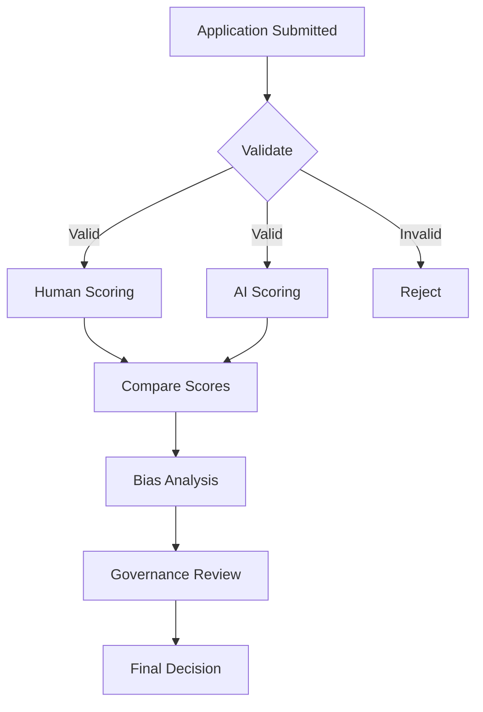

# AI Agents Infrastructure

This directory contains the AI agents system that powers the **Dual-Track Bias-Minimized Judging Program** for the Titan100 awards.

## Overview

The AI agents infrastructure provides an objective, consistent scoring system that complements human judging by:

1. **SoTruth AI Scoring Agent**: Provides unbiased, rubric-anchored evaluations
2. **Bias Analysis Agent**: Compares human vs AI scores to detect and quantify bias
3. **Application Validator Agent**: Ensures applications meet eligibility requirements

## Architecture

```
ai-agents/
├── agents/               # Agent implementations
│   ├── sotruth-scoring-agent.ts
│   ├── bias-analysis-agent.ts
│   └── validator-agent.ts (to be implemented)
├── config/               # Agent configurations
│   └── agent-config.ts
├── tools/                # Custom tools for agents
├── workflows/            # Workflow definitions
├── types.ts              # TypeScript type definitions
└── README.md             # This file
```

## Getting Started

### Prerequisites

- Node.js 18+
- Anthropic API key set in `.env` as `ANTHROPIC_API_KEY`
- Neon database configured

### Installation

The required packages are already installed:

```bash
npm install @anthropic-ai/claude-agent-sdk @anthropic-ai/sdk zod
```

### Environment Variables

Create a `.env` file with:

```env
DATABASE_URL=your_neon_database_url
ANTHROPIC_API_KEY=your_anthropic_api_key
```

## Usage

### 1. SoTruth AI Scoring Agent

The SoTruth agent scores applications objectively based on the rubric.

```typescript
import { createSoTruthAgent } from './agents/sotruth-scoring-agent';
import { type AIScoringInput } from './types';

const agent = createSoTruthAgent();

const input: AIScoringInput = {
  applicationId: 1,
  rubricId: 1,
  application: {
    /* application data */
  },
  rubric: {
    /* rubric definition */
  },
};

const evaluation = await agent.scoreApplication(input);

console.log(`Total Score: ${evaluation.totalScore}`);
console.log(`Flagged Concerns: ${evaluation.flaggedConcerns}`);
```

### 2. Bias Analysis Agent

The Bias Analysis agent compares human and AI evaluations.

```typescript
import { createBiasAnalysisAgent } from './agents/bias-analysis-agent';
import { type BiasAnalysisInput } from './types';

const agent = createBiasAnalysisAgent();

const input: BiasAnalysisInput = {
  applicationIds: [1, 2, 3],
  humanEvaluations: [
    /* human scores */
  ],
  aiEvaluations: [
    /* AI scores */
  ],
  rubric: {
    /* rubric */
  },
};

const analysis = await agent.analyzeBias(input);

console.log(`Correlation: ${analysis.overallCorrelation}`);
console.log(`Bias Indicators: ${analysis.biasIndicators.length}`);
```

## Agent Configuration

Each agent has a configuration in `config/agent-config.ts`:

```typescript
export const soTruthAgentConfig: AgentConfig = {
  name: 'SoTruth Scoring Agent',
  model: 'claude-sonnet-4-5-20250929',
  temperature: 0.3, // Lower for consistency
  systemPrompt: `...`, // Agent instructions
  tools: ['Read', 'Write'],
};
```

### Configuration Options

- **name**: Agent identifier
- **description**: What the agent does
- **model**: Claude model to use
- **temperature**: 0-1, lower = more consistent
- **maxTokens**: Maximum response length
- **systemPrompt**: Detailed instructions for the agent
- **tools**: Array of allowed tool names

## Workflow Integration

### Dual-Track Scoring Process



### Implementation

```typescript
// 1. Create workflow
const workflow = await db.insert(scoringWorkflows).values({
  applicationId: 1,
  status: 'pending',
});

// 2. Human judges score
// (via UI)

// 3. AI scores
const aiAgent = createSoTruthAgent();
const aiEval = await aiAgent.scoreApplication(input);

// 4. Bias analysis
const biasAgent = createBiasAnalysisAgent();
const analysis = await biasAgent.analyzeBias({
  humanEvaluations,
  aiEvaluations: [aiEval],
  rubric,
});

// 5. Update workflow
await db
  .update(scoringWorkflows)
  .set({
    humanScoringComplete: true,
    aiScoringComplete: true,
    biasAnalysisComplete: true,
    status: 'completed',
  })
  .where(eq(scoringWorkflows.id, workflow.id));
```

## Titan100 Specific Implementation

The Titan100 organization has specific requirements:

### Eligibility Requirements

- Business founded 3+ years ago
- Revenue over $1M
- Applicant holds C-suite title

### Judging Criteria

1. **Entrepreneurial Journey** (25%)
2. **Company Vision** (25%)
3. **What Makes Them a Titan** (25%)
4. **Accomplishments** (25%)

### Scoring Scale

- 1 = Poor
- 2 = Needs Improvement
- 3 = Satisfactory
- 4 = Good
- 5 = Outstanding

Maximum total score: 25 points (5 points × 4 criteria + overall)

## API Endpoints

The AI agents system integrates with these API endpoints:

### AI Evaluations

- `GET /api/ai-evaluations` - List AI evaluations
- `POST /api/ai-evaluations/score` - Trigger AI scoring

### Bias Analysis

- `GET /api/bias-analyses` - List bias analyses
- `POST /api/bias-analyses/run` - Run bias analysis

### Scoring Workflows

- `GET /api/scoring-workflows` - List workflows
- `POST /api/scoring-workflows` - Create workflow
- `PUT /api/scoring-workflows/:id` - Update workflow

### Titan100 Data

- `GET /api/titan100-data/:organizationId` - Get Titan100 org data

## Database Schema

### New Tables

- **pdf_documents**: Store org documents (instructions, guidelines)
- **ai_evaluations**: Store AI scoring results
- **bias_analyses**: Store bias analysis results
- **scoring_workflows**: Track scoring progress
- **titan100_org_data**: Titan100-specific configuration
- **judge_performance**: Track judge metrics
- **comparison_dashboard_data**: Pre-computed dashboard data

## Best Practices

### 1. Rubric Design

- Clear, measurable criteria
- Specific rating descriptions for each level (1-5)
- Appropriate criterion weights
- Examples of each rating level

### 2. Prompt Engineering

- Be specific about evaluation criteria
- Include examples in system prompts
- Request evidence-based reasoning
- Set appropriate temperature (0.2-0.4 for scoring)

### 3. Bias Mitigation

- Run bias analysis on every batch
- Review flagged discrepancies
- Calibrate judges based on analysis
- Document all governance decisions

### 4. Performance

- Use batch processing for multiple applications
- Cache frequently accessed data
- Pre-compute dashboard metrics
- Set reasonable timeouts

## Troubleshooting

### Agent Not Responding

- Check `ANTHROPIC_API_KEY` is set
- Verify API key has sufficient credits
- Check network connectivity
- Review agent logs

### Inconsistent Scores

- Review rubric clarity
- Check agent temperature (should be low)
- Verify application data completeness
- Test with calibration applications

### High Bias Indicators

- Review judge training materials
- Calibrate judges with AI scores
- Clarify rubric descriptions
- Consider judge performance metrics

## Development

### Adding a New Agent

1. Create agent file in `agents/`
2. Add configuration to `config/agent-config.ts`
3. Define types in `types.ts`
4. Add tests
5. Update documentation

### Testing Agents

```typescript
// Test with sample data
const testInput = {
  applicationId: -1, // Use negative for test
  rubricId: 1,
  application: sampleApplication,
  rubric: titan100Rubric,
};

const result = await agent.scoreApplication(testInput);
console.assert(result.totalScore >= 0 && result.totalScore <= 25);
```

## Resources

- [Claude Agent SDK Documentation](https://docs.anthropic.com/agent-sdk)
- [Anthropic API Documentation](https://docs.anthropic.com/)
- [Titan100 Website](https://titan100.biz)
- [Project Brief](../Project_Brief_Judging_App_09.22.25.pdf)
- [Judging Instructions](../Titan100.pdf)

## Support

For issues or questions:

- Technical issues: Create a GitHub issue
- Titan100 specific: Contact Brennan Jones (bjones@titanceo.com)
- Platform issues: Contact development team

## License

Confidential - VisualMedia, LTD 2025. All Rights Reserved.
